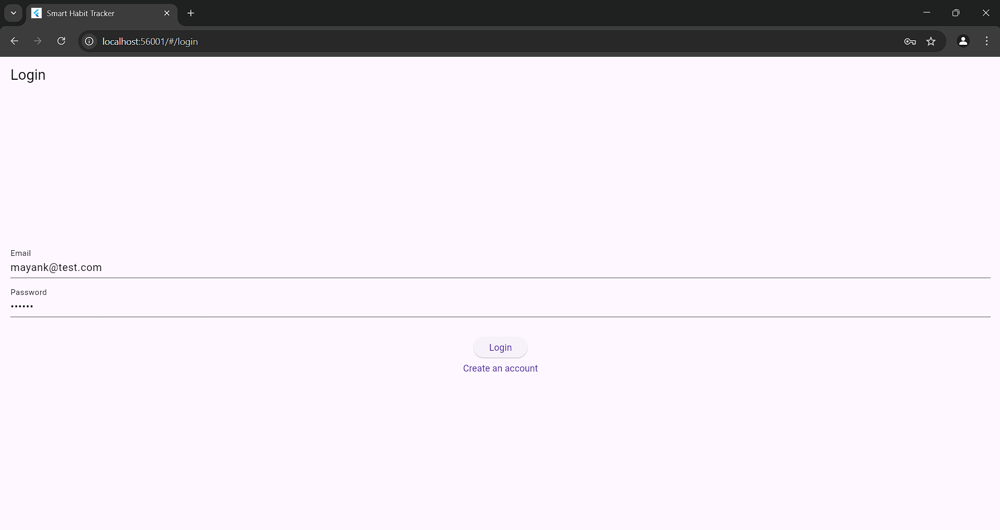
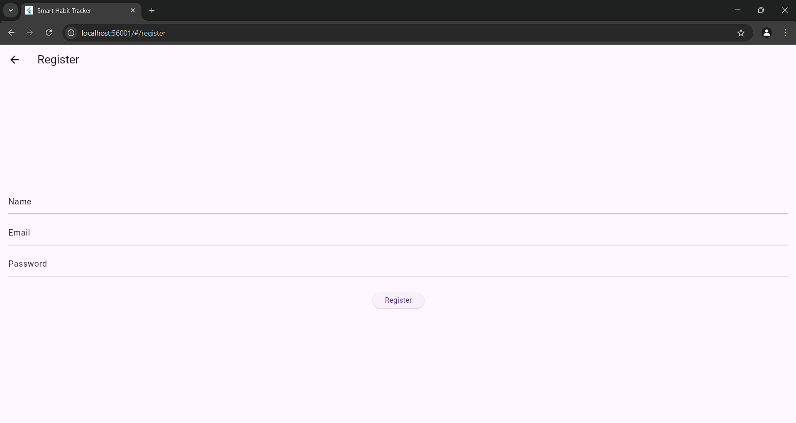
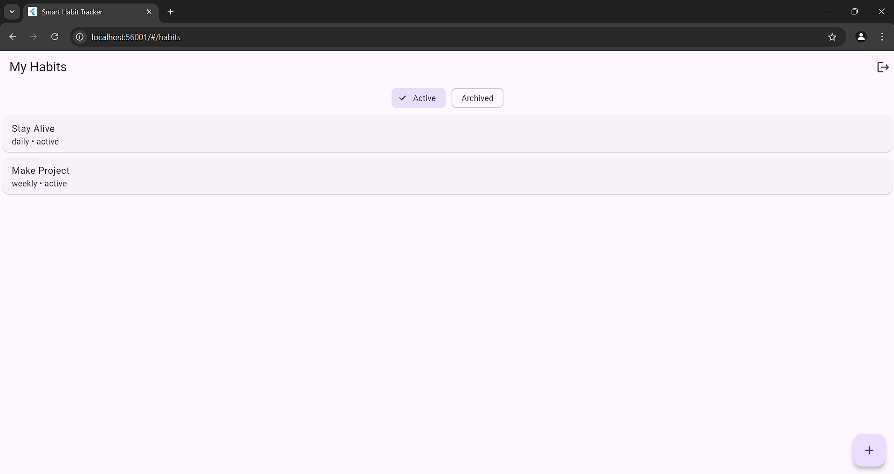
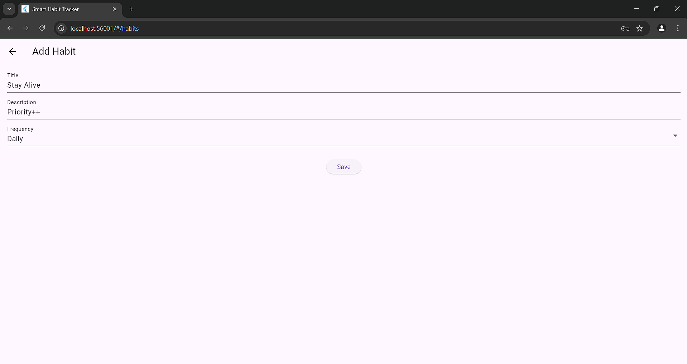
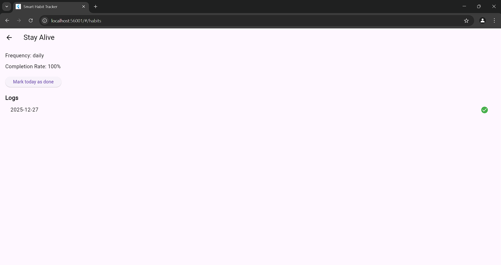
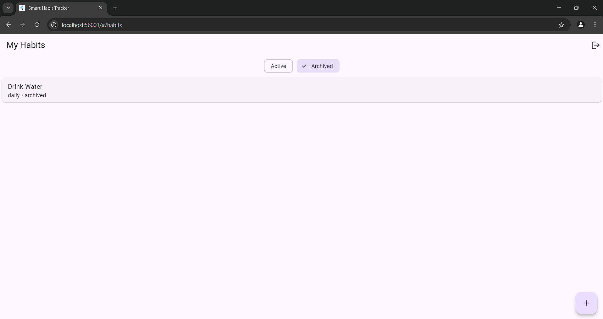
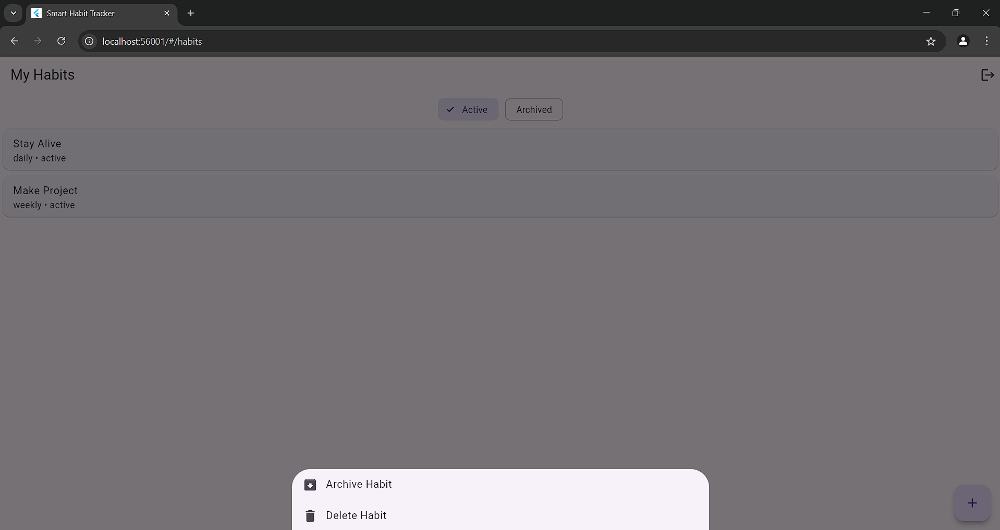

# 📱 Smart Habit Tracker

A **full-stack habit tracking application** built as part of a college assignment.  
The app allows users to create habits, track daily/weekly progress, view statistics, and manage active or archived habits.

---

## ✨ Features

- User registration and login (simple authentication, **no JWT**)
- Auto-login using local storage
- Create, edit, archive, and delete habits
- Mark habits as completed on specific days
- View habit logs and completion statistics
- Filter habits: **Active / Archived**
- Clean and simple mobile UI

---

## 🛠️ Tech Stack

### Frontend
- **Flutter**
- HTTP package for API calls
- SharedPreferences for local storage

### Backend
- **Node.js + Express**
- **MongoDB** (Atlas)
- bcrypt for password hashing
- RESTful API design

---

## 📂 Project Structure

habit-tracker/
├── backend/
│ ├── app.js
│ ├── routes/
│ ├── models/
│ ├── middleware/
│ ├── config/
│ ├── api-tests/
│ │ ├── screenshots.md
│ │ └── screenshots/
│ └── .env.example
│
├── frontend/
│ ├── pubspec.yaml
│ └── lib/
│ ├── screens/
│ ├── services/
│ └── models/
│
└── README.md


---

## 🔐 Authentication Design (Important Note)

This project **intentionally does NOT use JWT or sessions**, as required by the assignment.

### How authentication works:
- Backend returns a `userId` on successful login
- Frontend stores `userId` using SharedPreferences
- Every protected API request sends `userId`
- Backend trusts the `userId` sent by the client

📌 **This limitation is documented and intentional**, as per assignment guidelines.

---

## 📸 Application Screenshots

> Application UI screenshots are included in the repository (screenshots folder).

### 🔑 Login Screen


### 📝 Register Screen


### 📋 Habit List (Active Habits)


### ➕ Add / Edit Habit


### 📊 Habit Details (Logs & Stats)


### 📦 Archived Habits


### 📦 Delete/Archive (Long Press the habit in Active tab)


---

## 🧪 Backend API Testing

All backend APIs were **tested using Postman**.

### Tested Endpoints
- Register
- Login
- Create habit
- Get habits
- Update habit
- Delete habit
- Mark habit completion
- Get habit logs
- Get habit statistics

📁 **API test screenshots are available at: /backend/api-tests/screenshots.md**


## 🚀 Setup Instructions

### Backend Setup

```bash
cd backend
npm install

Create a .env file using .env.example:
MONGO_URL=your_mongo_url_here
PORT=3000

Run backend:
node app.js

Frontend Setup:
cd frontend
flutter pub get
flutter run

📌 Note for Android Emulator:
The backend is accessed using the local IP address (for example: http://192.168.x.x:3000).

👤 Author
Mayank Kandari