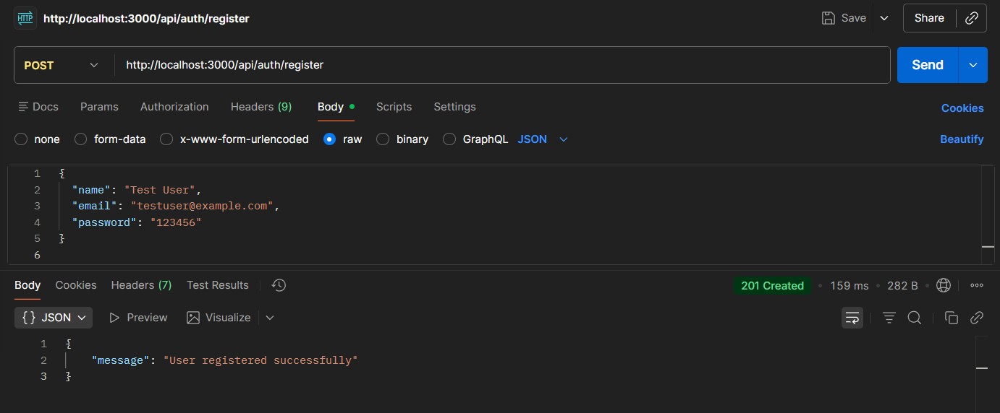
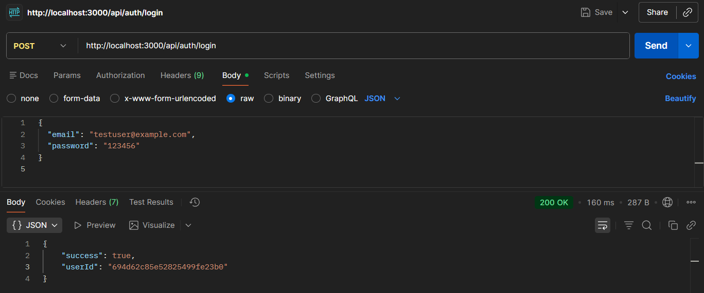
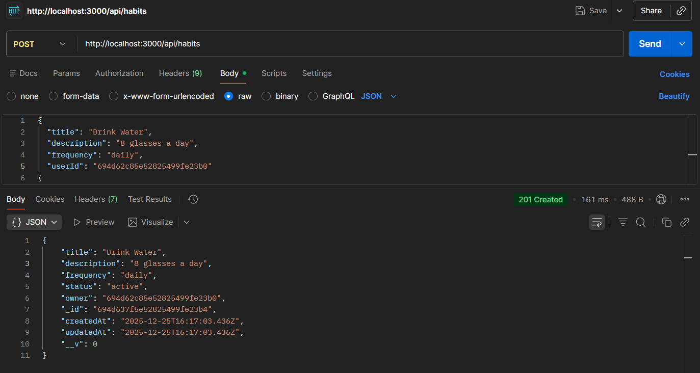
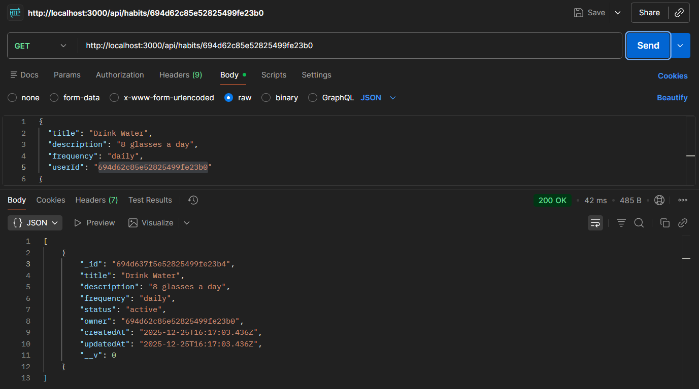
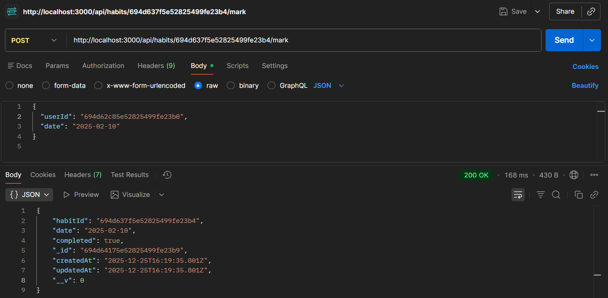
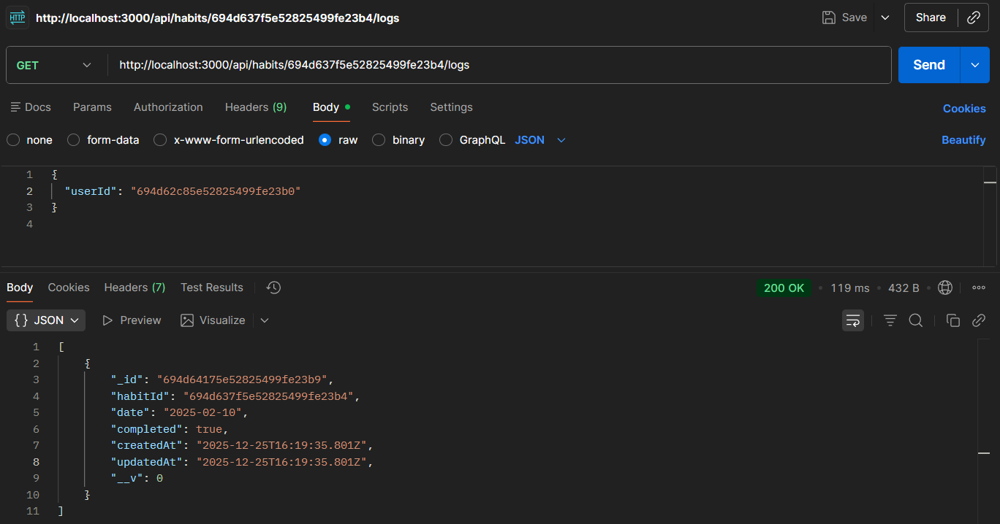
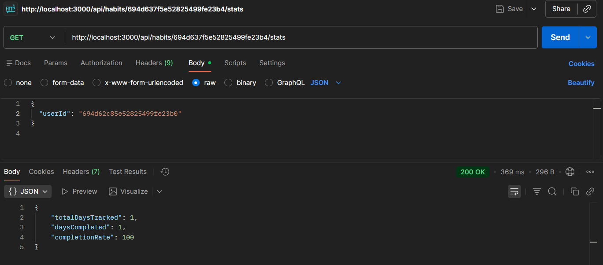
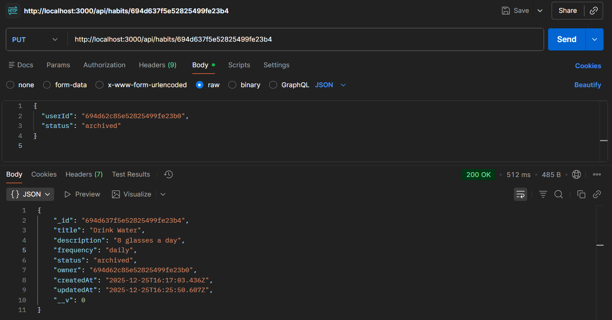
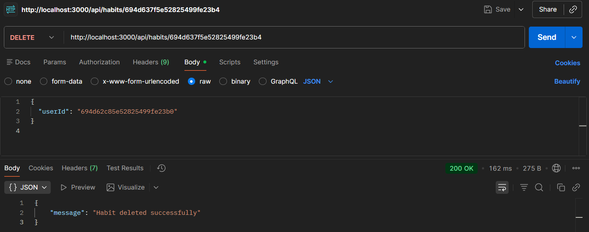

# API Testing Screenshots

## 1. Register User

## 2. Login User

## 3. Create Habit

## 4. Get Habits

## 5. Mark Habit

## 6. Get Logs

## 7. Get Stats

## 8. Update Habit

## 9. Delete Habit

